# 🚆 Railway Management System (DBMS Capstone)

> **Real-Life Scenario: Indian Railways Passenger Reservation System (IRCTC)**  
> Built with Next.js 15, TypeScript, Tailwind CSS, and a **real PostgreSQL 16 Relational Database Engine**.

---

---

## 🌟 Executive Summary

This project is a fully functional, database-backed **Railway Management System** designed and built for a collegiate Database Management Systems (DBMS) Capstone. Rather than using mock buttons or fake client-side storage, this system interacts with a real relational PostgreSQL database engine enforcing strict ACID transactions, primary/foreign keys, integrity constraints (`CHECK`, `NOT NULL`, `UNIQUE`, `DEFAULT`), automated PL/pgSQL database triggers (`Reservation_Audit`), and compiled relational SQL views (`Passenger_Reservation_View`).

---

## 📸 System Screenshots

### 1. Modern Homepage & Live PostgreSQL Stats
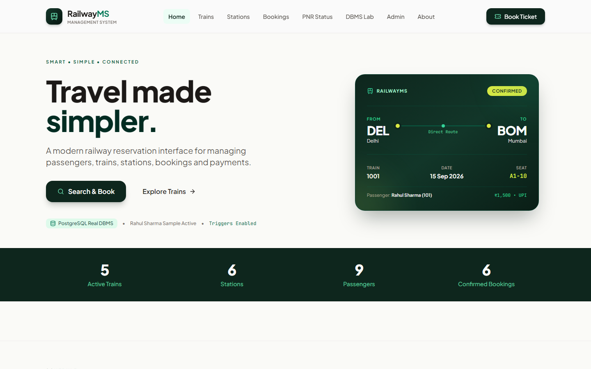

### 2. Available Trains Schedule & Route Timelines
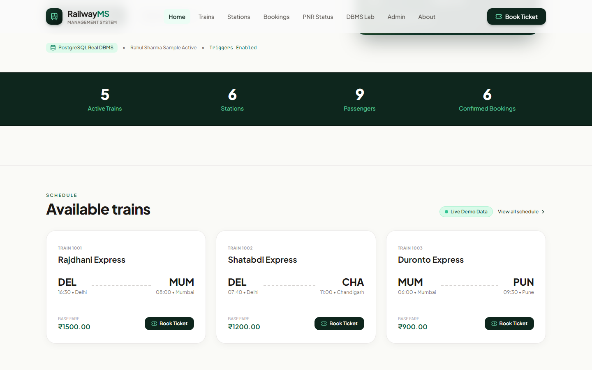

### 3. Major Railway Network Stations
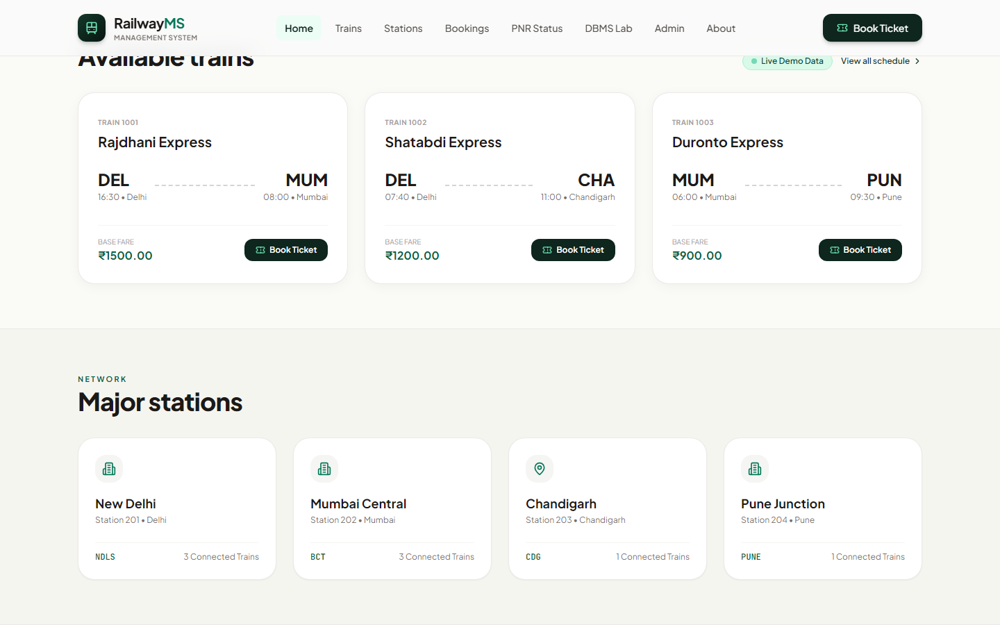

### 4. Interactive Booking Modal (Matching PDF Page 8)
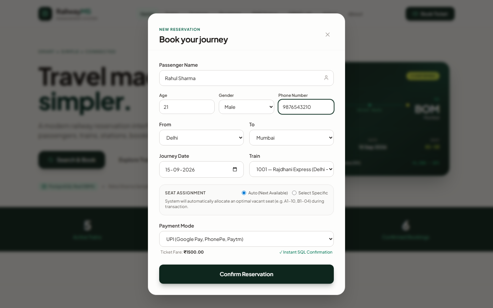

### 5. Instant Reservation Confirmation & Confetti
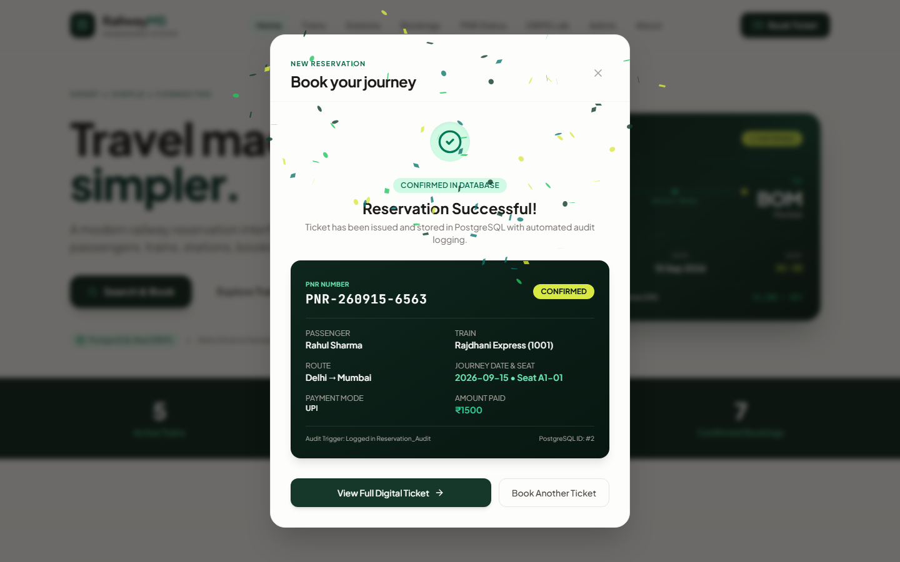

### 6. Digital Printable Boarding Pass & PNR Status
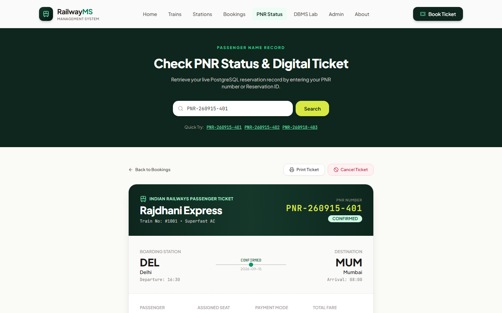

### 7. Interactive DBMS Lab & SQL Demo Console
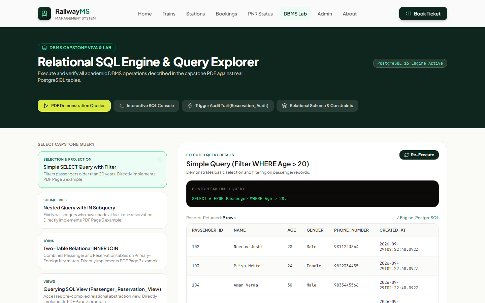

### 8. Automated Database Trigger Audit Log (`Reservation_Audit`)
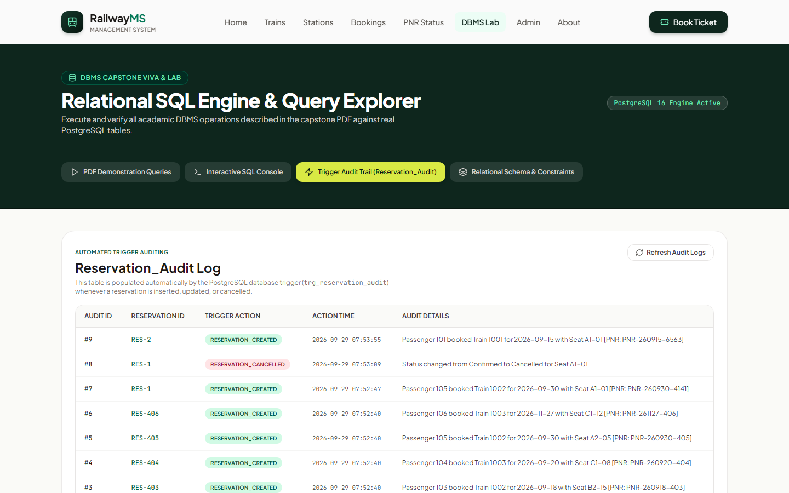

### 9. Protected Admin CRUD Management Portal
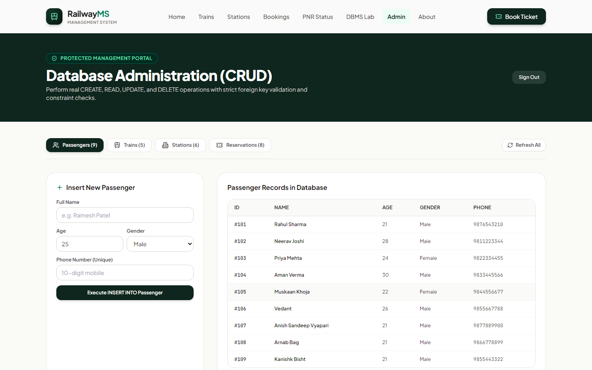

### 10. Mobile Responsive Experience (375px Viewport)
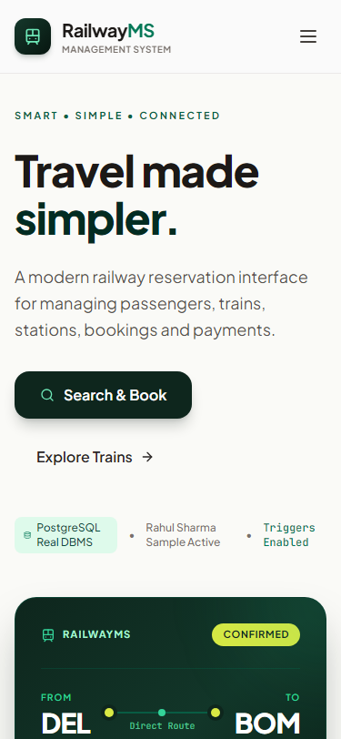

---

## 🗄️ Relational Database Architecture

### Entity-Relationship Diagram (ERD)

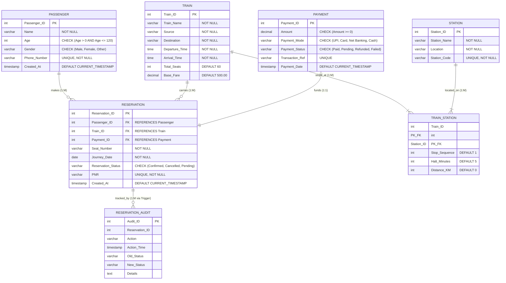

---

## ⚡ DBMS Concepts Implemented

### 1. DDL, DML & Integrity Constraints
- **Primary Keys**: Explicitly defined on `Passenger_ID`, `Train_ID`, `Station_ID`, `Payment_ID`, `Reservation_ID`, and composite `(Train_ID, Station_ID)`.
- **Foreign Keys**: Enforced on `Reservation` referencing `Passenger`, `Train`, and `Payment` with cascading and restrict constraints.
- **CHECK Constraints**: Validate passenger age (`1-120`), non-negative payment fares, valid payment modes, and valid reservation statuses.
- **UNIQUE Constraints**: 
  - `Phone_Number` on `Passenger`
  - `PNR` on `Reservation`
  - `(Train_ID, Journey_Date, Seat_Number)` on `Reservation` &mdash; **Prevents duplicate seat bookings at the database engine level**.

### 2. Required Capstone SQL Queries

- **Simple Selection (Filter)**:
  ```sql
  SELECT * FROM Passenger WHERE Age > 20;
  ```
- **Nested Subquery (`IN` operator)**:
  ```sql
  SELECT Name FROM Passenger 
  WHERE Passenger_ID IN (SELECT Passenger_ID FROM Reservation);
  ```
- **Two-Table Relational INNER JOIN**:
  ```sql
  SELECT P.Name, R.Reservation_ID, R.Seat_Number 
  FROM Passenger P 
  JOIN Reservation R ON P.Passenger_ID = R.Passenger_ID;
  ```
- **SQL View (`Passenger_Reservation_View`)**:
  ```sql
  CREATE OR REPLACE VIEW Passenger_Reservation_View AS
  SELECT P.Name AS Passenger_Name, P.Age, P.Phone_Number,
         R.Reservation_ID, R.PNR, R.Seat_Number, R.Journey_Date, R.Reservation_Status
  FROM Passenger P
  JOIN Reservation R ON P.Passenger_ID = R.Passenger_ID;
  ```
- **PL/pgSQL Trigger & Audit Log**:
  ```sql
  CREATE OR REPLACE FUNCTION trg_fn_reservation_audit()
  RETURNS TRIGGER AS $$
  BEGIN
      IF (TG_OP = 'INSERT') THEN
          INSERT INTO Reservation_Audit (Reservation_ID, Action, New_Status, Details)
          VALUES (NEW.Reservation_ID, 'RESERVATION_CREATED', NEW.Reservation_Status,
                  'Passenger ' || NEW.Passenger_ID || ' booked Train ' || NEW.Train_ID || ' Seat ' || NEW.Seat_Number);
      ELSIF (TG_OP = 'UPDATE') THEN
          INSERT INTO Reservation_Audit (Reservation_ID, Action, Old_Status, New_Status, Details)
          VALUES (NEW.Reservation_ID, 'RESERVATION_CANCELLED', OLD.Reservation_Status, NEW.Reservation_Status,
                  'Status changed from ' || OLD.Reservation_Status || ' to ' || NEW.Reservation_Status);
      END IF;
      RETURN NEW;
  END;
  $$ LANGUAGE plpgsql;

  CREATE TRIGGER trg_reservation_audit
  AFTER INSERT OR UPDATE ON Reservation
  FOR EACH ROW EXECUTE FUNCTION trg_fn_reservation_audit();
  ```

---

## 🚀 Quick Start / Local Setup

### Option A: One-Click Windows Batch Launcher (Recommended)
Simply double-click:
```cmd
START_RAILWAY_SYSTEM.bat
```
This script will automatically verify Node.js, install dependencies if missing, start the PostgreSQL engine, and launch your browser to `http://localhost:3000`.

### Option B: Manual Command Line Setup
1. **Clone Repository**:
   ```bash
   git clone https://github.com/Lanthanode/PROJECT-VIKAS.git
   cd PROJECT-VIKAS
   ```
2. **Install Dependencies**:
   ```bash
   npm install
   ```
3. **Run Application**:
   ```bash
   npm run dev
   ```
4. **Open in Browser**:
   Navigate to [http://localhost:3000](http://localhost:3000).

---

## 🔐 Administrative Access
- **Admin Portal**: [http://localhost:3000/admin](http://localhost:3000/admin)
- **Master Password**: `admin123`

---

## 📂 Project Repository Structure
```
PROJECT-VIKAS/
├── app/
│   ├── api/                   # Server API routes (stats, trains, bookings, sql, audit)
│   ├── trains/                # Train schedule and search page
│   ├── stations/              # Major stations network catalog
│   ├── bookings/              # Recent reservations and cancellation management
│   ├── pnr/                   # PNR status & digital printable boarding pass
│   ├── dbms-lab/              # Interactive SQL query runner & viva lab
│   ├── admin/                 # Protected CRUD administration portal
│   ├── about/                 # Capstone team members & viva guide
│   ├── layout.tsx             # Root layout with fonts & metadata
│   └── page.tsx               # Homepage matching PDF reference screenshots
├── components/
│   ├── Navbar.tsx             # Navigation header
│   ├── BookingModal.tsx       # Booking modal with live seat assignment
│   └── Footer.tsx             # Academic footer with member roll numbers
├── database/
│   ├── schema.sql             # Full PostgreSQL DDL with all constraints
│   ├── seed.sql               # Seed data matching PDF sample records
│   ├── queries.sql            # Simple, nested, join, and aggregate queries
│   ├── views.sql              # Compiled SQL views
│   ├── triggers.sql           # PL/pgSQL trigger and audit function
│   └── er-diagram/            # Mermaid ER diagram
├── docs/
│   ├── SETUP.md               # Step-by-step setup guide
│   ├── USER_GUIDE.md          # User workflow guide
│   ├── CAPSTONE_REPORT.md     # Academic Capstone Report (13 PDF sections)
│   ├── TEST_REPORT.md         # Full testing report (25 test cases)
│   ├── VIVA_QUESTIONS.md      # Viva examiner Q&A
│   └── SETUP_GUIDE.pdf        # High-fidelity printable PDF setup guide
├── scripts/
│   ├── capture_screenshots.py # Playwright automated screenshot script
│   └── generate_docs_pdf.py   # PDF compilation script
├── screenshots/               # 15 real application screenshots
├── START_RAILWAY_SYSTEM.bat   # One-click Windows development launcher
├── BUILD_AND_RUN_PRODUCTION.bat # One-click Windows production runner
├── SETUP_GUIDE.pdf            # Printable Setup Guide PDF in root
└── package.json
```

---

## 🎓 Academic Presentation Sequence (For Viva / Professor)
1. **Homepage (`/`)**: Point out live stats calculated dynamically via SQL (`COUNT(*)`, `SUM(Amount)`).
2. **Train Schedule (`/trains`)**: Search "Delhi" to "Mumbai" & show Rajdhani Express (Train 1001).
3. **Live Booking Modal**: Enter "Rahul Sharma" (Age 21, UPI) & complete reservation.
4. **Trigger Verification (`/dbms-lab`)**: Show `Reservation_Audit` table instantly updated by PostgreSQL trigger `trg_reservation_audit`.
5. **Duplicate Seat Prevention**: Attempt to book the same seat on the same train/date to prove `unique_train_journey_seat` constraint blocks it.
6. **Digital Ticket & PNR (`/pnr`)**: Search the generated PNR to show printable boarding pass.
7. **Ticket Cancellation**: Cancel ticket to demonstrate status change to 'Cancelled' and immediate seat release.
8. **DBMS SQL Runner (`/dbms-lab`)**: Run Simple Query (`Age > 20`), Nested Query (`IN`), and Two-Table JOIN to show raw PostgreSQL execution.

---
© 2026 RailwayMS &mdash; Computer Science & Engineering DBMS Capstone Project.
